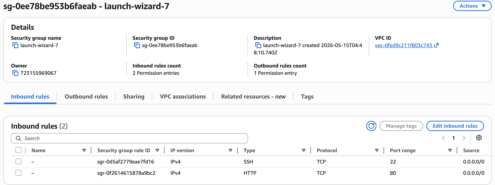
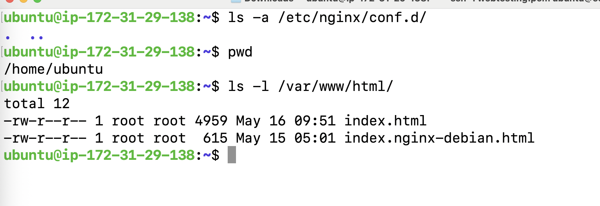

# Cloud-Learnings

Project 1 : Webserver on AWS 

    1. login to AWS console and navigate to EC2 services.
    2. Lanuch instance and configured with Ubuntu OS.
    3. Configured security groups for secure access (SSH),for application access (80) inbound rules.
    4. Installed Nginx webserver and configured to serve index.html file /var/www/html.
    5. Enabled ufw to allow connections from vpc, subnet to Ec2 Nginx service.
    6. Vertified access through public ip using web browser(Chrome).

Screenshots of the project:-

1. Instance creation

2. Security groups configuration

3. Nginx installation and setup

4. Copied HTML file in instance

5. Verified with public IP

